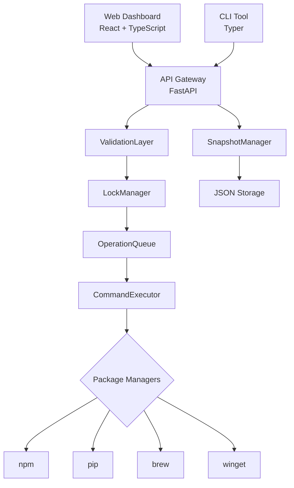

# Package Audit Dashboard

<div align="center">


**Centralized package manager auditing and management with advanced security features**

[Codespaces Setup](CODESPACES.md){ .md-button .md-button--primary }
[View on GitHub](https://github.com/nsalvacao/Package_Audit_Dashboard){ .md-button }

</div>

---

## Overview

Package Audit Dashboard is a full-stack application designed to audit, manage, and secure package managers across different ecosystems. It provides centralized control over npm, pip, winget, and brew with robust security controls, snapshot management, and vulnerability scanning.

## ✨ Key Features

### Phase 1 (MVP) - Completed

- **🔍 Auto-discovery** - Automatically detect installed package managers
- **🗑️ Safe Uninstall** - Remove packages with automatic snapshots
- **🔒 Security Layer** - Multi-layer validation and protection
- **🎯 REST API** - Complete API with auto-generated documentation
- **💻 CLI Tool** - Command-line interface for terminal operations
- **🌐 Web Dashboard** - Modern React-based UI
- **📊 Snapshot Management** - Backup and restore functionality

### Phase 2 - Completed

- **📡 Real-time Streaming** - Monitor operations live with SSE
- **🌳 Dependency Trees** - Visualize package dependencies
- **🔐 Vulnerability Scanning** - Integrated security scanning
- **📦 Batch Operations** - Manage multiple packages at once
- **⏮️ Automatic Rollback** - Revert changes automatically
- **📄 Lock File Export** - Download lock files for backup

## 🚀 Quick Start

### Using Docker (Recommended)

```bash
git clone https://github.com/nsalvacao/Package_Audit_Dashboard.git
cd Package_Audit_Dashboard
docker-compose up -d
```

**Access:**
- Dashboard: [http://localhost:5173](http://localhost:5173)
- API Docs: [http://localhost:8000/docs](http://localhost:8000/docs)
- Health Check: [http://localhost:8000/health](http://localhost:8000/health)

### Manual Installation

```bash
# Backend
cd backend
python3 -m venv .venv
source .venv/bin/activate
pip install -r requirements.txt
uvicorn app.main:app --reload

# Frontend (new terminal)
cd frontend
npm install
npm run dev
```

[View Codespaces setup →](CODESPACES.md)

## 🏗️ Architecture



## 📦 Supported Package Managers

| Manager | Status | Features |
|---------|--------|----------|
| **npm** (Node.js) | ✅ Full Support | List, Uninstall, Audit, Dependencies, Lockfile |
| **pip** (Python) | ✅ Full Support | List, Uninstall, Audit*, Dependencies*, Lockfile |
| **brew** (macOS) | ⚠️ Basic Support | List, Uninstall |
| **winget** (Windows) | ⚠️ Basic Support | List, Uninstall |

\* Requires optional dependencies: `pip-audit`, `pipdeptree`

## 🔒 Security

Package Audit Dashboard implements a **4-layer security architecture**:

1. **ValidationLayer** - Input sanitization and injection prevention
2. **LockManager** - Race condition prevention with file-based locking
3. **OperationQueue** - Sequential operation execution
4. **CommandExecutor** - Safe command execution with timeouts

[Learn more about security →](SECURITY.md)

## 📊 Phase 2 Highlights

### Real-time Streaming

Monitor package operations live:

```javascript
const eventSource = new EventSource(
  '/api/streaming/npm/packages/lodash/uninstall'
);

eventSource.onmessage = (event) => {
  console.log(JSON.parse(event.data));
};
```

### Vulnerability Scanning

```bash
curl http://localhost:8000/api/advanced/npm/vulnerabilities
```

Returns detailed security information about your packages.

### Dependency Trees

```bash
curl http://localhost:8000/api/advanced/npm/dependency-tree
```

Visualize complete dependency hierarchies.

## 🛠️ Requirements

### Backend
- Python 3.10+
- pip
- virtualenv

### Frontend
- Node.js 18+
- npm or yarn

### Optional Tools
- pip-audit (for Python vulnerability scanning)
- pipdeptree (for Python dependency trees)

[View optional dependencies →](OPTIONAL_DEPENDENCIES.md)

## 📚 Documentation

- **[Codespaces Setup](CODESPACES.md)** - Get up and running quickly with GitHub Codespaces
- **[Copilot Guide](COPILOT_GUIDE.md)** - Learn to use GitHub Copilot effectively
- **[API Reference](API.md)** - Complete API documentation
- **[PATH Setup](SETUP_PATH.md)** - Configure PATH for package managers
- **[Docker Guide](DOCKER.md)** - Docker deployment

## 🤝 Contributing

Contributions are welcome! Check out our [GitHub repository](https://github.com/nsalvacao/Package_Audit_Dashboard).

```bash
# Fork and clone
git clone https://github.com/YOUR_USERNAME/Package_Audit_Dashboard.git

# Create feature branch
git checkout -b feature/amazing-feature

# Make changes and commit
git commit -m 'feat: add amazing feature'

# Push and create PR
git push origin feature/amazing-feature
```

## 📝 License

This project is licensed under the MIT License - see the [LICENSE](https://github.com/nsalvacao/Package_Audit_Dashboard/blob/main/LICENSE) file for details.

## 🗺️ Roadmap

### Phase 3 (Planned - Q3 2025)
- Multi-user support
- Cloud backup integration
- Advanced analytics dashboard
- Plugin system for extensibility
- AI-powered usage recommendations

See [GitHub Issues](https://github.com/nsalvacao/Package_Audit_Dashboard/issues) for more details.

## 💬 Support

- **Issues**: [GitHub Issues](https://github.com/nsalvacao/Package_Audit_Dashboard/issues)
- **Discussions**: [GitHub Discussions](https://github.com/nsalvacao/Package_Audit_Dashboard/discussions)
- **Documentation**: [https://nsalvacao.github.io/Package_Audit_Dashboard/](https://nsalvacao.github.io/Package_Audit_Dashboard/)

---

<div align="center">

**Built with ❤️ using FastAPI and React**

</div>
